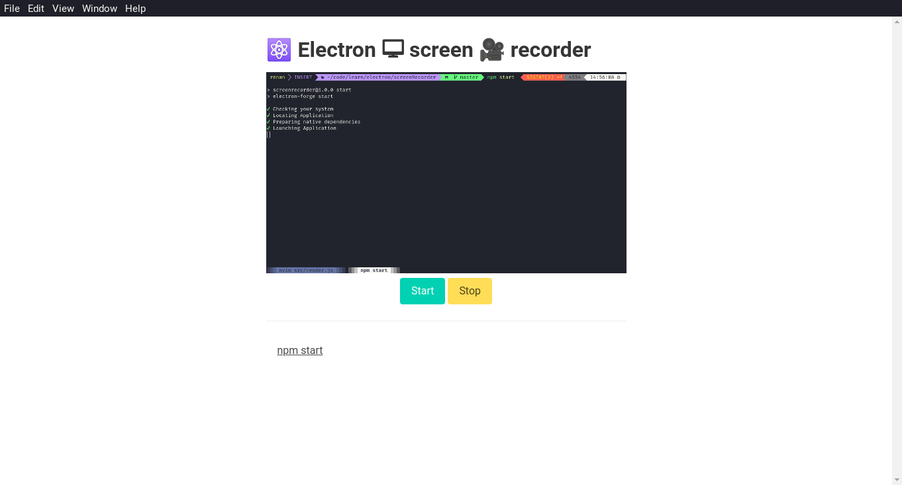

# electron-screen-recorder

electron screen recorder made with the help of youtube tutorial with some minor changes

## try locally

if you want to try it locally you can run:
- git clone https://github.com/renanbrayner/electron-screen-recorder.git
- cd electron-screen-recorder
- npm start

## how to use
- click on `Chose a Video Source` and select your desired video source (preview will be provided)
- click on `Start` to start recording
- click on `Stop` and select where the file should be saved
- done!
